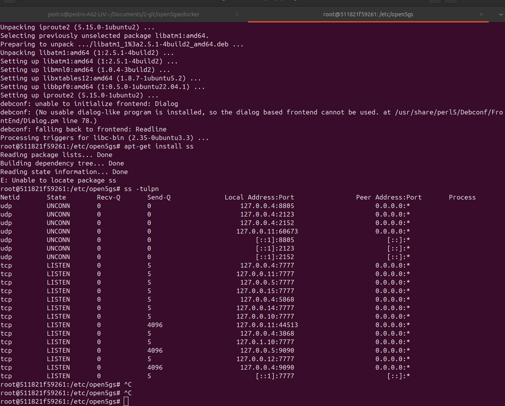

# Open5GS 5G Core – Ambiente Docker Compose

Este repositório contém um ambiente **Open5GS 5G Core** orquestrado com **Docker Compose**, atendendo aos requisitos mínimos de inicialização do core, exposição de interfaces e validação de funcionamento.

O objetivo é disponibilizar um **core 5G funcional**, pronto para integração futura com RAN/UE (ex.: UERANSIM), futuramente.

---

## 📦 Repositório

Este repositório contém:

- `docker-compose.yml` – Orquestração dos serviços do Open5GS
- `README.md` – Documentação completa (instalação, execução e validação)
- `.env` – Arquivo de parametrização do ambiente

```bash
MONGOUSER=
MONGOPASS=
```


---

## 🧱 Arquitetura do Ambiente

O ambiente é composto, no mínimo, por:

- **Mongo-Express** – Banco de dados do Open5GS
- **MongoDB** – Banco de dados do Open5GS
- **Open5Gs** – Network Repository Function

Todas as funções são executadas como **containers Docker**, orquestrados via **Docker Compose**.

---

## 🖥️ Requisitos do Sistema

- Sistema operacional: **Ubuntu 22.04+** (ou equivalente Linux)


###  1️⃣ Clonar o repositório

```bash
git clone <URL_DO_REPOSITORIO>
cd open5gs-docker
```

###  2️⃣ Configurar variáveis de ambiente

```bash
cp .env.example .env
```


###  ▶️ Execução do Ambiente

```bash
docker compose up -d
```


## 📁 Evidências (Checklist)

Durante a validação, recomenda-se coletar:

#### Sistemas operacional
<p align="center">
  
</p>


#### Portas usada pelo Open5GS
<p align="center">
  
</p>


#### Servico Funcionando usada pelo Open5GS visto pelo htop
<p align="center">
  
</p>


#### Docker Compose up  funcionando dentro docker.
<p align="center">
  
</p>


